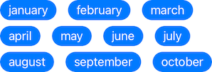
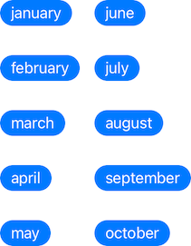

<p>
  <a href="https://github.com/vinceplusplus/views-wrap/actions?query=workflow%3Atest+event%3Apush">
    
  </a>
  <a href="https://codecov.io/gh/vinceplusplus/views-wrap">
    
  </a>
</p>

# views-wrap

`views-wrap` is a collection of SwiftUI container views to achieve views wrapping behavior, flow layout or `flex-wrap: wrap` from CSS flexbox layout

A tag cloud can be achieved easily with the following code:
```swift
struct Tag: ViewModifier {
  func body(content: Content) -> some View {
    content
      .foregroundColor(.white)
      .frame(maxWidth: 144)
      .fixedSize()
      .padding(.horizontal, 12)
      .padding(.vertical, 4)
      .background(Color.blue)
      .cornerRadius(64)
  }
}

HWrap(maxWidth: 320, hSpacing: 16, vSpacing: 8) {
  Text("january").modifier(Tag())
  Text("february").modifier(Tag())
  Text("march").modifier(Tag())
  Text("april").modifier(Tag())
  Text("may").modifier(Tag())
  Text("june").modifier(Tag())
  Text("july").modifier(Tag())
  Text("august").modifier(Tag())
  Text("september").modifier(Tag())
  Text("october").modifier(Tag())
}
```



`VWrap` is the vertical counterpart



## Usage

### Installation

To install through Xcode, follow the [official guide](https://developer.apple.com/documentation/xcode/adding_package_dependencies_to_your_app) to add the following your Xcode project
```
https://github.com/vinceplusplus/views-wrap
```

To install through Swift Package Manager, add the following as package dependency and target dependency respectively
```
.package(url: "https://github.com/vinceplusplus/views-wrap", from: "1.0.0")
```
```
"ViewsWrap" // or .product(name: "ViewsWrap", package: "views-wrap")
```

### Integration

Import module `ViewsWrap`

Use `HWrap` or `VWrap`. ForEach like and view builder initializers are supported

